# MCP Tool Cookbook

This cookbook provides examples of how to use the `mcp` tool to query and understand your Python codebase. The "Tool" indicates which `mcp` tool to use, and the "JSON Arguments" are what the LLM would provide to that tool.

---

## Basic Queries

### 1. Find a specific function by name
- **Natural Language:** "Where is the function `foo` defined?"
- **Tool:** `find_code`
- **JSON Arguments:**
```json
{
  "query": "foo"
}
```


### 2. Find all calls to a specific function
- **Natural Language:** "Find all calls to the `helper` function."
- **Tool:** `analyze_code_relationships`
- **JSON Arguments:**
```json
{
  "query_type": "find_callers",
  "target": "helper"
}
```


### 3. Find what a function calls
- **Natural Language:** "What functions are called inside the `foo` function?"
- **Tool:** `analyze_code_relationships`
- **JSON Arguments:**
```json
{
  "query_type": "find_callees",
  "target": "foo",
  "context": "/teamspace/studios/this_studio/demo/CodeGraphContext/tests/sample_project/module_a.py"
}
```

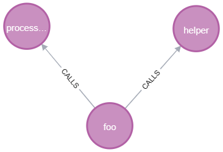

### 4. Find all imports of a specific module
- **Natural Language:** "Where is the `math` module imported?"
- **Tool:** `analyze_code_relationships`
- **JSON Arguments:**
```json
{
  "query_type": "find_importers",
  "target": "math"
}
```

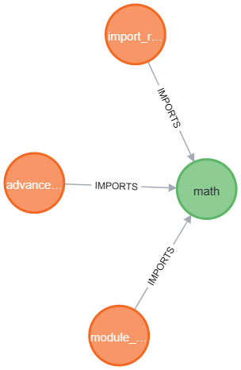

### 5. Find all methods of a class
- **Natural Language:** "What are the methods of the `A` class?"
- **Tool:** `analyze_code_relationships`
- **JSON Arguments:**
```json
{
  "query_type": "class_hierarchy",
  "target": "A"
}
```
- **Note:** The response for `class_hierarchy` includes a list of methods.


### 6. Find all classes that inherit from a specific class
- **Natural Language:** "Show me all classes that inherit from `Base`."
- **Tool:** `analyze_code_relationships`
- **JSON Arguments:**
```json
{
  "query_type": "class_hierarchy",
  "target": "Base"
}
```
- **Note:** The response for `class_hierarchy` includes a list of child classes.

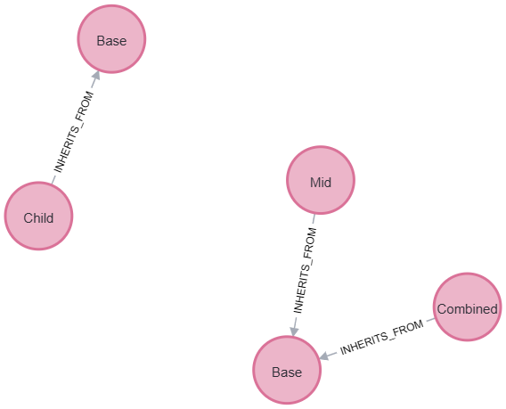

### 7. Find all functions with a specific decorator
- **Natural Language:** "Find all functions with the `log_decorator`."
- **Tool:** `analyze_code_relationships`
- **JSON Arguments:**
```json
{
  "query_type": "find_functions_by_decorator",
  "target": "log_decorator"
}
```


### 8. Find all dataclasses
- **Natural Language:** "Find all dataclasses."
- **Tool:** `execute_cypher_query`
- **JSON Arguments:**
```json
{
  "cypher_query": "MATCH (c:Class) WHERE 'dataclass' IN c.decorators RETURN c.name, c.file_path"
}
```


---

## Code Analysis & Quality

### 9. Find the 5 most complex functions
- **Natural Language:** "Find the 5 most complex functions."
- **Tool:** `find_most_complex_functions`
- **JSON Arguments:**
```json
{
  "limit": 5
}
```

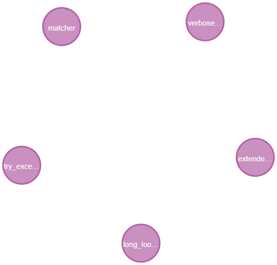

### 10. Calculate cyclomatic complexity of a function
- **Natural Language:** "What is the cyclomatic complexity of `try_except_finally`?"
- **Tool:** `calculate_cyclomatic_complexity`
- **JSON Arguments:**
```json
{
  "function_name": "try_except_finally"
}
```

### 11. Find unused code
- **Natural Language:** "Find unused code, but ignore API endpoints decorated with `@app.route`."
- **Tool:** `find_dead_code`
- **JSON Arguments:**
```json
{
  "exclude_decorated_with": ["@app.route"]
}
```


### 12. Find the call chain between two functions
- **Natural Language:** "What is the call chain from `wrapper` to `helper`?"
- **Tool:** `analyze_code_relationships`
- **JSON Arguments:**
```json
{
  "query_type": "call_chain",
  "target": "wrapper->helper"
}
```

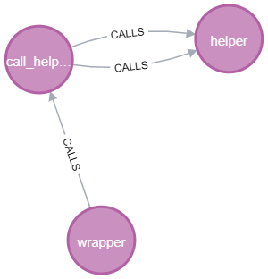

### 13. Find all direct and indirect callers of a function
- **Natural Language:** "Show me all functions that eventually call the `helper` function."
- **Tool:** `analyze_code_relationships`
- **JSON Arguments:**
```json
{
  "query_type": "find_all_callers",
  "target": "helper"
}
```

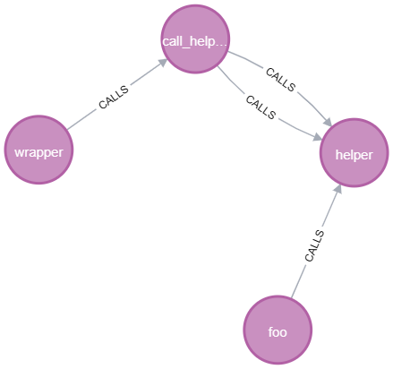

### 14. Find functions by argument name
- **Natural Language:** "Find all functions that take `self` as an argument."
- **Tool:** `analyze_code_relationships`
- **JSON Arguments:**
```json
{
  "query_type": "find_functions_by_argument",
  "target": "self"
}
```

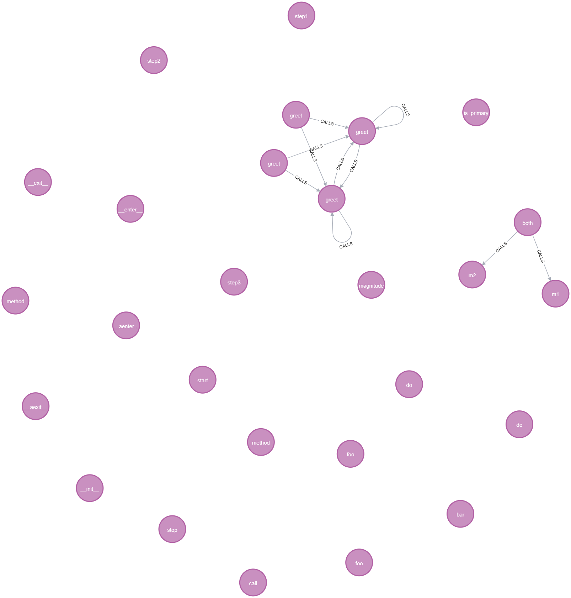

### 15. List all python package imports from a directory
- **Natural Language:** "List all python package imports from my project directory."
- **Tool:** `execute_cypher_query`
- **JSON Arguments:**
```json
{
  "cypher_query": "MATCH (f:File)-[:IMPORTS]->(m:Module) WHERE f.path ENDS WITH '.py' RETURN DISTINCT m.name"
}
```

---

## Repository Information Queries

### 16. List all indexed projects
- **Natural Language:** "List all projects I have indexed."
- **Tool:** `list_indexed_repositories`
- **JSON Arguments:**
```json
  {}
```


### 17. Check the status of an indexing job
- **Natural Language:** "What is the status of job `4cb9a60e-c1b1-43a7-9c94-c840771506bc`?"
- **Tool:** `check_job_status`
- **JSON Arguments:**
```json
{
  "job_id": "4cb9a60e-c1b1-43a7-9c94-c840771506bc"
}
```

### 18. List all background jobs
- **Natural Language:** "Show me all background jobs."
- **Tool:** `list_jobs`
- **JSON Arguments:**
```json
  {}
```

---

## Advanced Cypher Queries

These examples use the `execute_cypher_query` tool for more specific and complex questions.

### 19. Find all function definitions
- **Natural Language:** "Find all function definitions in the codebase."
- **JSON Arguments:**
```json
{
  "cypher_query": "MATCH (n:Function) RETURN n.name, n.file_path, n.line_number LIMIT 50"
}
```


### 20. Find all classes
- **Natural Language:** "Show me all the classes."
- **JSON Arguments:**
```json
{
  "cypher_query": "MATCH (n:Class) RETURN n.name, n.file_path, n.line_number LIMIT 50"
}
```

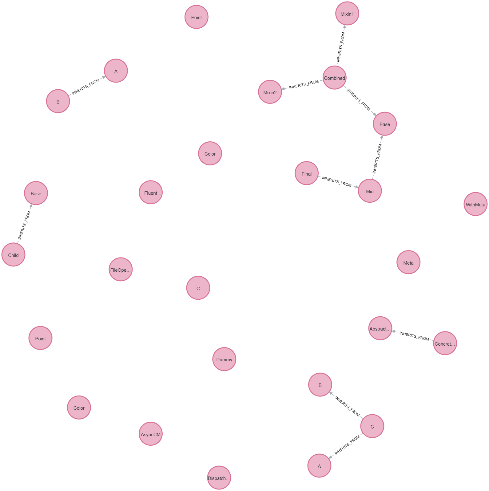

### 21. Find all functions in a file
- **Natural Language:** "Find all functions in `module_a.py`."
- **JSON Arguments:**
```json
{
  "cypher_query": "MATCH (f:Function) WHERE f.file_path ENDS WITH 'module_a.py' RETURN f.name"
}
```

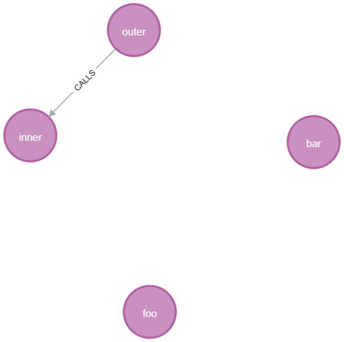

### 22. Find all classes in a file
- **Natural Language:** "Find all classes in `advanced_classes.py`."
- **JSON Arguments:**
```json
{
  "cypher_query": "MATCH (c:Class) WHERE c.file_path ENDS WITH 'advanced_classes.py' RETURN c.name"
}
```


### 23. List all top-level functions and classes in a file
- **Natural Language:** "List all top-level functions and classes in `module_a.py`."
- **JSON Arguments:**
```json
{
  "cypher_query": "MATCH (f:File)-[:CONTAINS]->(n) WHERE f.name = 'module_a.py' AND (n:Function OR n:Class) AND n.context IS NULL RETURN n.name"
}
```


### 24. Find functions in one module that call a function in another
- **Natural Language:** "Find functions in `module_a.py` that call `helper` in `module_b.py`."
- **JSON Arguments:**
```json
{
  "cypher_query": "MATCH (caller:Function)-[:CALLS]->(callee:Function {name: 'helper'}) WHERE caller.file_path ENDS WITH 'module_a.py' AND callee.file_path ENDS WITH 'module_b.py' RETURN caller.name"
}
```


### 25. Find circular file imports
- **Natural Language:** "Are there any circular dependencies between files?"
- **JSON Arguments:**
```json
{
  "cypher_query": "MATCH (f1:File)-[:IMPORTS]->(m2:Module), (f2:File)-[:IMPORTS]->(m1:Module) WHERE f1.name = m1.name + '.py' AND f2.name = m2.name + '.py' RETURN f1.name, f2.name"
}
```

### 26. Find all functions with more than 5 arguments
- **Natural Language:** "Find all functions with a large number of arguments."
- **JSON Arguments:**
```json
{
  "cypher_query": "MATCH (f:Function) WHERE size(f.args) > 5 RETURN f.name, f.file_path, size(f.args) as arg_count"
}
```


### 27. Find all functions in a file that have a docstring
- **Natural Language:** "Find all functions in `module_a.py` that have a docstring."
- **JSON Arguments:**
```json
{
  "cypher_query": "MATCH (f:Function) WHERE f.file_path ENDS WITH 'module_a.py' AND f.docstring IS NOT NULL AND f.docstring <> '' RETURN f.name"
}
```

### 28. Find all classes that have a specific method
- **Natural Language:** "Find all classes that have a `greet` method."
- **JSON Arguments:**
```json
{
  "cypher_query": "MATCH (c:Class)-[:CONTAINS]->(m:Function {name: 'greet'}) RETURN c.name, c.file_path"
}
```

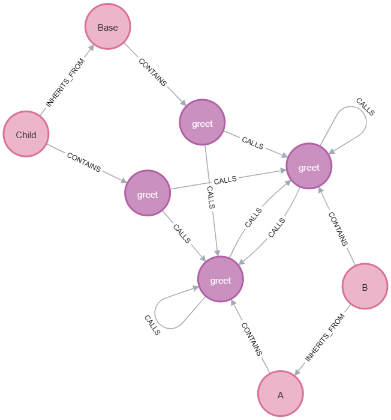

### 29. Find the depth of inheritance for all classes
- **Natural Language:** "How deep are the inheritance chains for all classes?"
- **JSON Arguments:**
```json
{
  "cypher_query": "MATCH (c:Class) OPTIONAL MATCH path = (c)-[:INHERITS*]->(parent:Class) RETURN c.name, c.file_path, length(path) AS depth ORDER BY depth DESC"
}
```

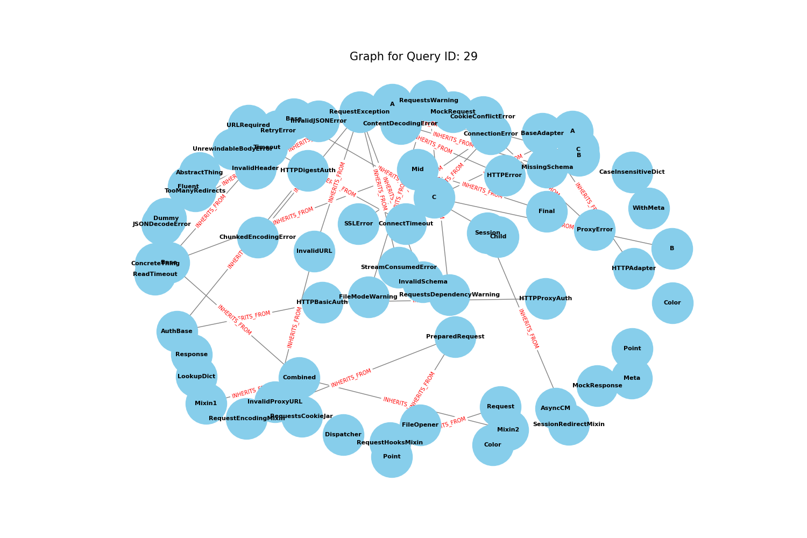

### 30. Find all functions that have a docstring
- **Natural Language:** "Show me all functions that are documented."
- **JSON Arguments:**
```json
{
  "cypher_query": "MATCH (f:Function) WHERE f.docstring IS NOT NULL AND f.docstring <> '' RETURN f.name, f.file_path LIMIT 50"
}
```

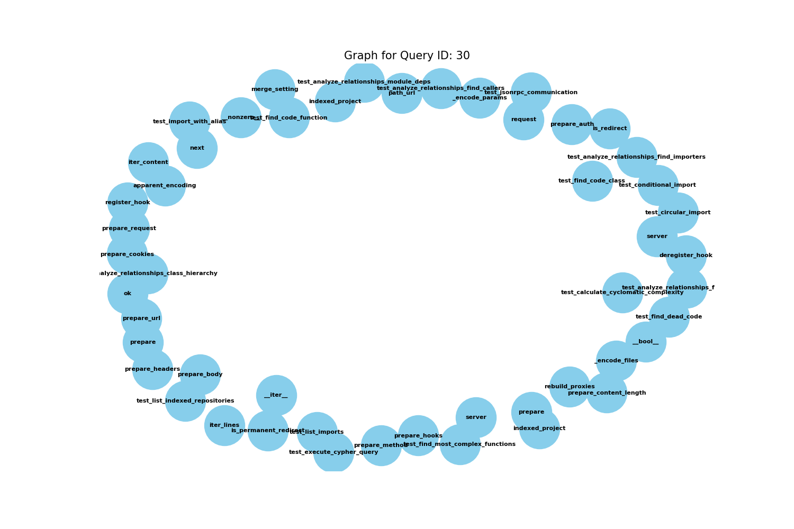

### 31. Find all decorated methods in a class
- **Natural Language:** "Find all decorated methods in the `Child` class."
- **JSON Arguments:**
```json
{
  "cypher_query": "MATCH (c:Class {name: 'Child'})-[:CONTAINS]->(m:Function) WHERE m.decorators IS NOT NULL AND size(m.decorators) > 0 RETURN m.name"
}
```

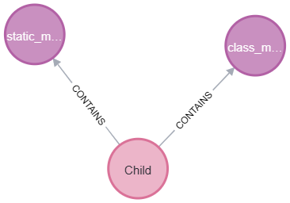

### 32. Find the number of functions in each file
- **Natural Language:** "How many functions are in each file?"
- **JSON Arguments:**
```json
{
  "cypher_query": "MATCH (f:Function) RETURN f.file_path, count(f) AS function_count ORDER BY function_count DESC"
}
```

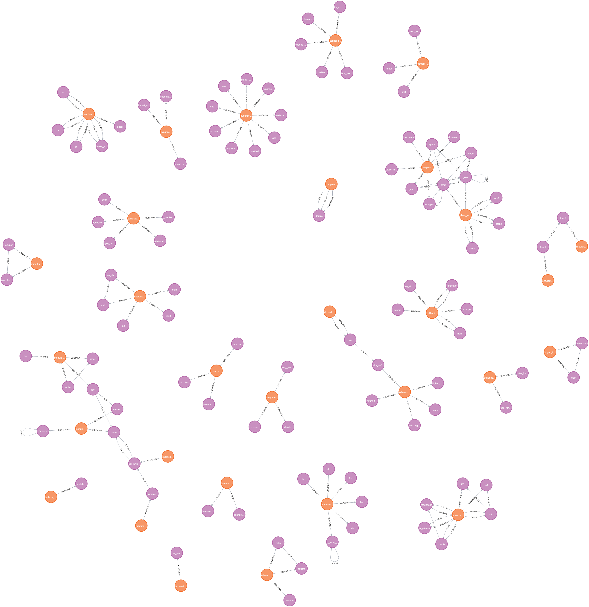

### 33. Find all methods that override a parent method
- **Natural Language:** "Find all methods that are overridden from a parent class."
- **JSON Arguments:**
```json
{
  "cypher_query": "MATCH (c:Class)-[:INHERITS]->(p:Class), (c)-[:CONTAINS]->(m:Function), (p)-[:CONTAINS]->(m_parent:Function) WHERE m.name = m_parent.name RETURN m.name as method, c.name as child_class, p.name as parent_class"
}
```

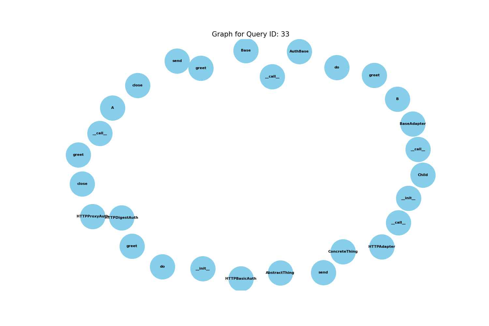

### 34. Find all functions that call `super()`
- **Natural Language:** "Find all methods that call their parent's method via `super()`."
- **JSON Arguments:**
```json
{
  "cypher_query": "MATCH (f:Function)-[r:CALLS]->() WHERE r.full_call_name STARTS WITH 'super(' RETURN f.name, f.file_path"
}
```

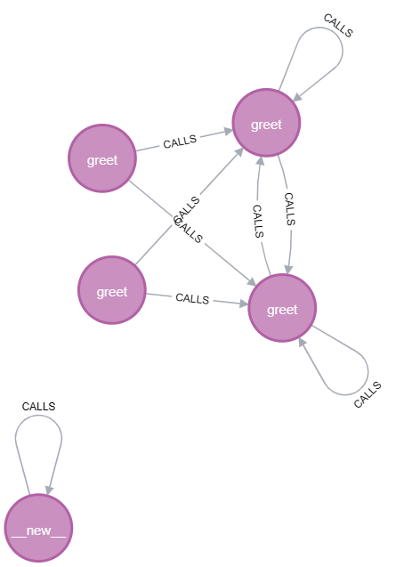

### 35. Find all calls to a function with a specific argument
- **Natural Language:** "Find all calls to `helper` with the argument `x`."
- **JSON Arguments:**
```json
{
  "cypher_query": "MATCH ()-[r:CALLS]->(f:Function {name: 'helper'}) WHERE 'x' IN r.args RETURN r.full_call_name, r.line_number, r.file_path"
}
```

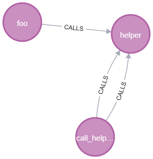

### 36. Find all functions that are not called by any other function
- **Natural Language:** "Find all dead code (functions that are never called)."
- **JSON Arguments:**
```json
{
  "cypher_query": "MATCH (f:Function) WHERE NOT (()-[:CALLS]->(f)) AND f.is_dependency = false RETURN f.name, f.file_path"
}
```

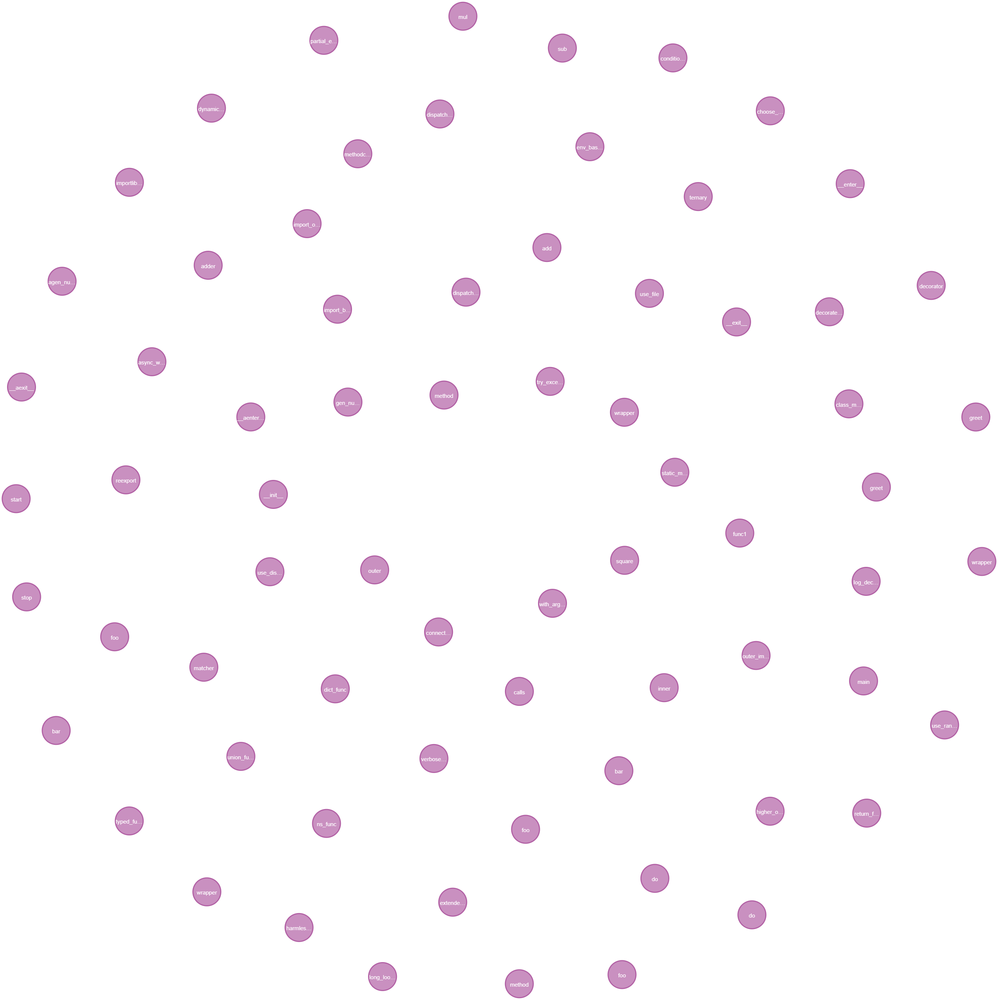

### 37. Find all functions that are called with a specific argument
- **Natural Language:** "Find all calls to `print` with the argument `'hello'`."
- **JSON Arguments:**
```json
{
  "cypher_query": "MATCH (c:Call) WHERE c.name = 'print' AND 'hello' IN c.args RETURN c.file, c.lineno"
}
```

### 38. Find all direct and indirect callees of a function
- **Natural Language:** "Show me all functions that are eventually called by the `foo` function."
- **Tool:** `analyze_code_relationships`
- **JSON Arguments:**
```json
{
  "query_type": "find_all_callees",
  "target": "foo",
  "context": "/teamspace/studios/this_studio/demo/CodeGraphContext/tests/sample_project/module_a.py"
}
```

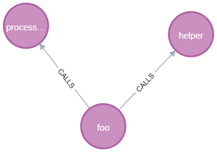

### 39. Find all functions that are overridden
- **Natural Language:** "Find all functions that are overridden."
- **Tool:** `analyze_code_relationships`
- **JSON Arguments:**
```json
{
  "query_type": "overrides",
  "target": "foo"
}
```


### 40. Find all modules imported by `module_a`
- **Natural Language:** "Find all modules imported by `module_a`."
- **Tool:** `execute_cypher_query`
- **JSON Arguments:**
```json
{
  "cypher_query": "MATCH (f:File {name: 'module_a.py'})-[:IMPORTS]->(m:Module) RETURN m.name AS imported_module_name"
}
```

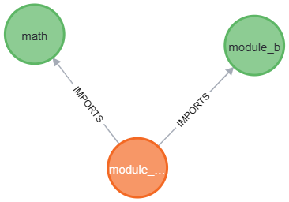

### 41. Find large functions that should be refactored
- **Natural Language:** "Find functions with more than 20 lines of code that might need refactoring."
- **Tool:** `execute_cypher_query`
- **JSON Arguments:**
```json
{
  "cypher_query": "MATCH (f:Function)\n    WHERE f.end_line - f.line_number > 20\n    RETURN f"
}
```

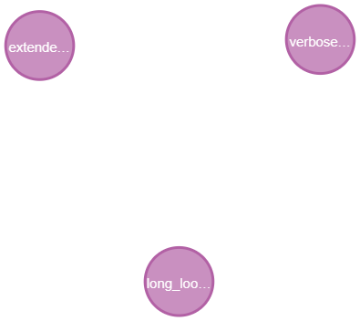

### 42. Find recursive functions
- **Natural Language:** "Find all functions that call themselves (recursive functions)."
- **Tool:** `execute_cypher_query`
- **JSON Arguments:**
```json
{
  "cypher_query": "MATCH p=(f:Function)-[:CALLS]->(f2:Function)\n    WHERE f.name = f2.name AND f.file_path = f2.file_path\n    RETURN p"
}
```
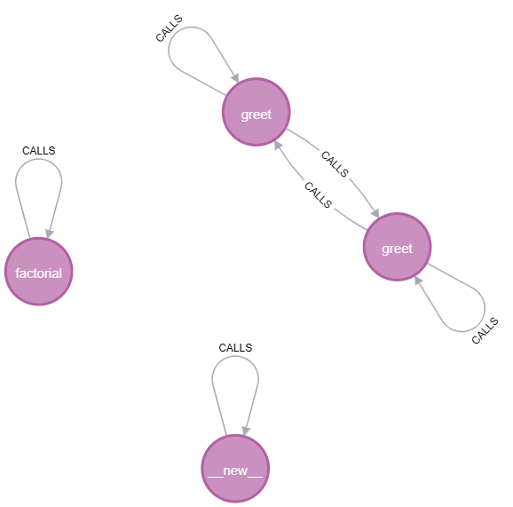

### 43. Find most connected functions (hub functions)
- **Natural Language:** "Find the functions that are most central to the codebase (called by many and call many others)."
- **Tool:** `execute_cypher_query`
- **JSON Arguments:**
```json
{
  "cypher_query": "MATCH (f:Function)\n    OPTIONAL MATCH (f)-[:CALLS]->(callee:Function)\n    OPTIONAL MATCH (caller:Function)-[:CALLS]->(f)\n    WITH f, count(DISTINCT callee) AS calls_out, count(DISTINCT caller) AS calls_in\n    ORDER BY (calls_out + calls_in) DESC\n    LIMIT 5\n    MATCH p=(f)-[*0..2]-()\n    RETURN p"
}
```
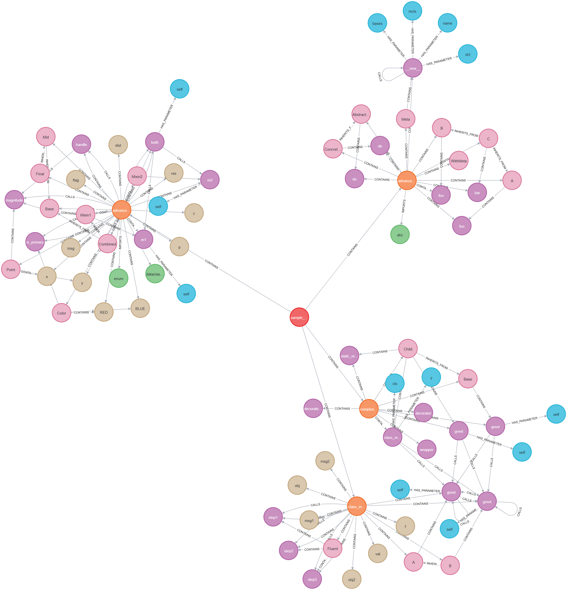

## Security & Sensitive Data Analysis

### 44. Find potential security vulnerabilities (hardcoded secrets)
- **Natural Language:** "Find potential hardcoded passwords, API keys, or secrets in the codebase."
- **Tool:** `execute_cypher_query`
- **JSON Arguments:**
```json
{
  "cypher_query": "WITH [\"password\",  \"api_key\", \"apikey\",    \"secret_token\", \"token\", \"auth\", \"access_key\", \"private_key\", \"client_secret\", \"sessionid\", \"jwt\"] AS keywords\n    MATCH (f:Function)\n    WHERE ANY(word IN keywords WHERE toLower(f.source_code) CONTAINS word)\n    RETURN f"
}
```